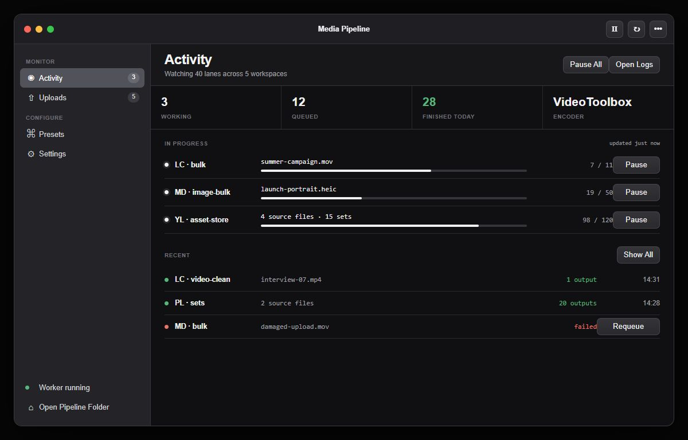
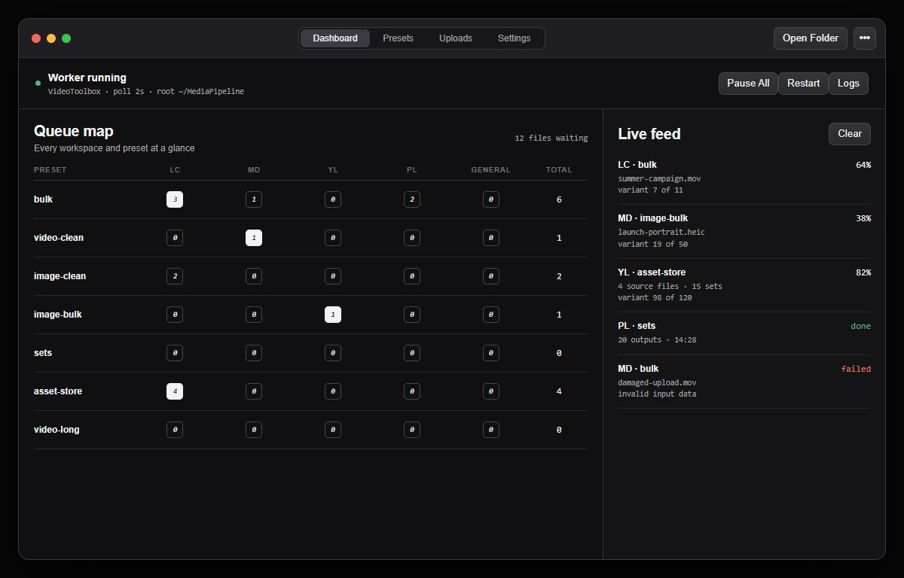
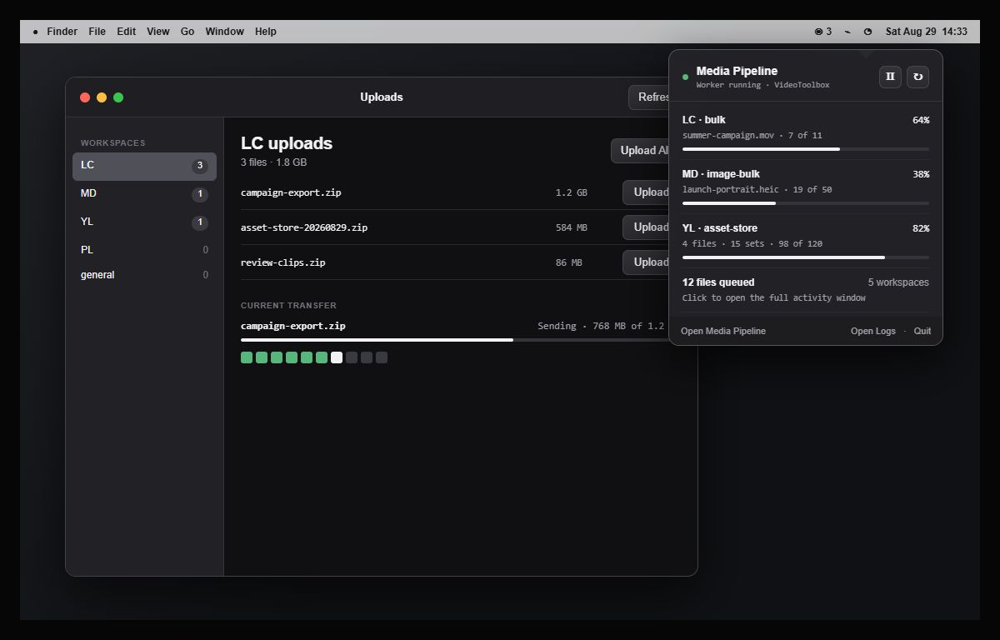

# macOS interface concepts

All three concepts preserve the Windows app's restrained visual language: ordinary state is
monochrome, green means completed, and red means failed. Each uses native macOS window controls,
system typography, toolbar behavior, and dark-mode materials.

## A. Native sidebar

A conventional `NavigationSplitView` puts Activity and Uploads first, configuration second, and
worker state at the bottom. It scales cleanly, stays familiar to Mac users, and provides the best
base for the complete feature set. This is the recommended direction.

## B. Operations dashboard

A compact segmented toolbar keeps the queue map visible. It is the fastest way to scan every lane,
but individual jobs receive less space and the workspace-by-preset matrix becomes dense when the
configuration grows.

## C. Menu bar first

The menu bar popover handles routine monitoring and pause/restart controls while a focused window
opens for uploads and configuration. It feels the most Mac-specific and is excellent for passive
operation, but the popover cannot replace the full window for detailed work.
